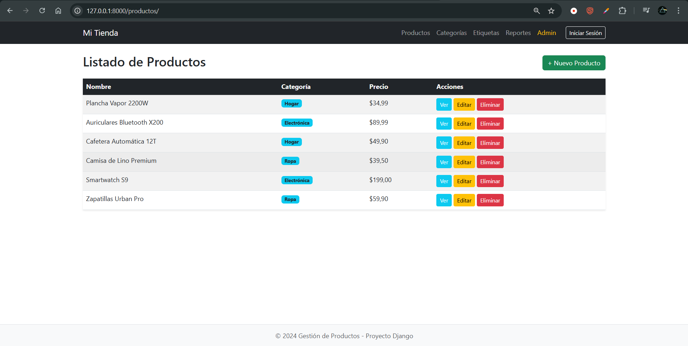
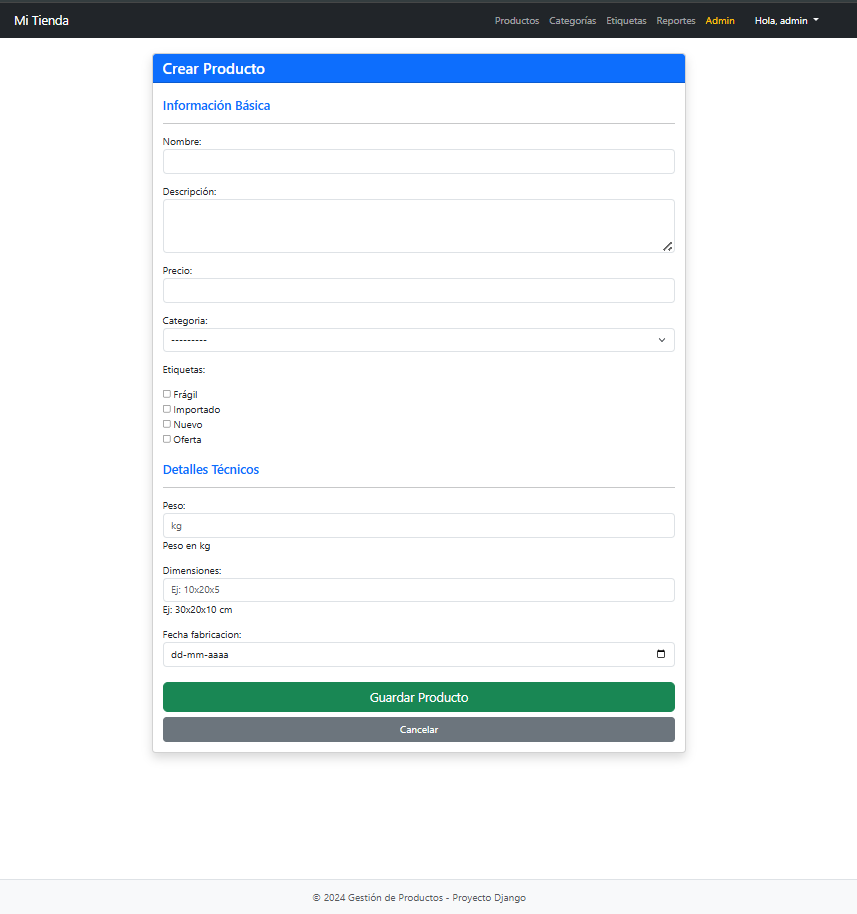
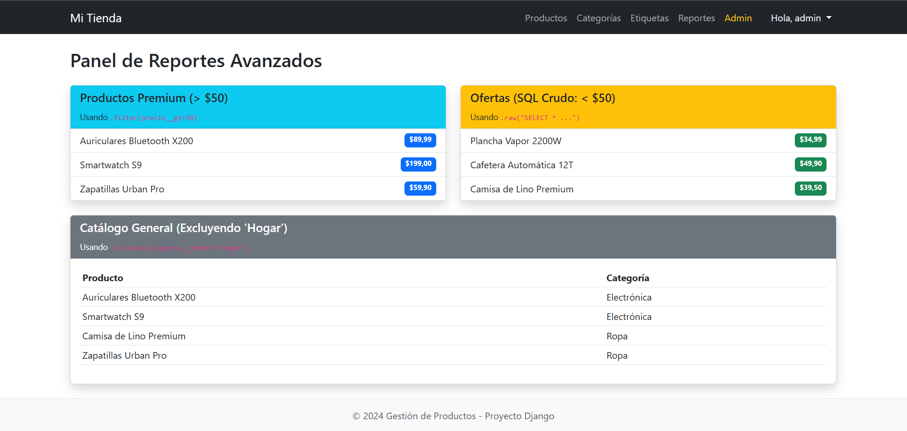
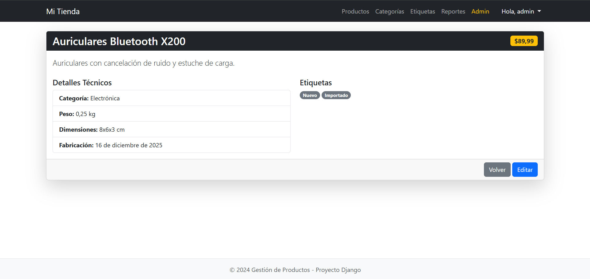
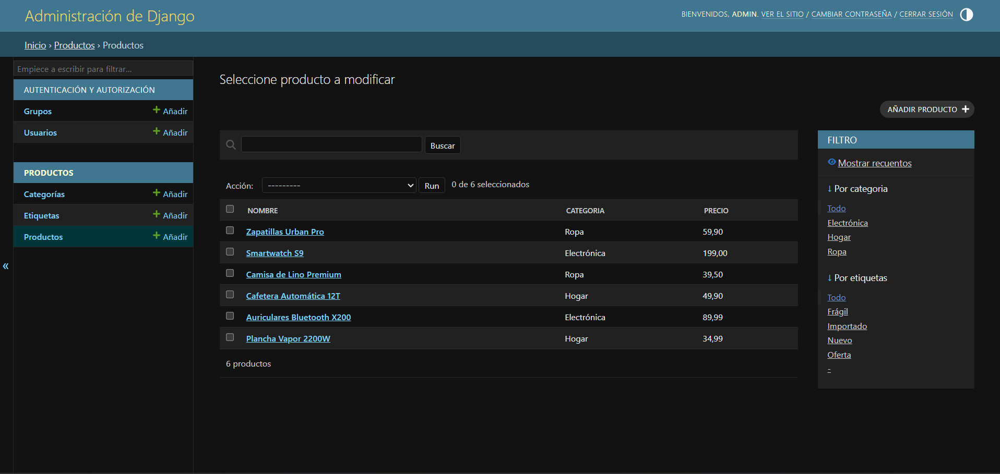
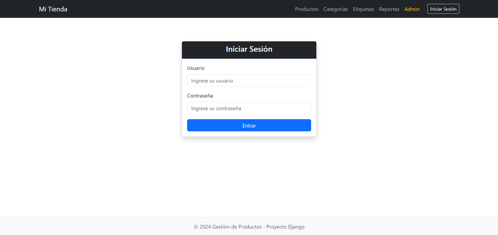

# Sistema de Gestión de Inventario (Django + MySQL)

Este proyecto es una aplicación web Full Stack desarrollada en Django para la gestión de productos, categorías y etiquetas. Implementa un sistema CRUD completo, autenticación de usuarios y reportes avanzados utilizando MySQL como base de datos.

## 📋 Requisitos Previos

* Python 3.10 o superior
* MySQL Server (Workbench recomendado)
* Git

## 🚀 Instalación y Ejecución Local

Sigue estos pasos para ejecutar el proyecto en tu máquina:

1.  **Clonar el repositorio:**
    ```bash
    git clone https://github.com/RJaqE/M7_proyecto_final_django.git
    cd M7_proyecto_final_django
    ```

2.  **Crear y activar el entorno virtual:**
    ```powershell
    python -m venv env
    .\env\Scripts\Activate
    ```

3.  **Instalar dependencias:**
    ```bash
    pip install -r requirements.txt
    ```

4.  **Configurar Base de Datos:**
    * Abre MySQL Workbench y crea una base de datos vacía:
        ```sql
        CREATE DATABASE gestion_productos_db CHARACTER SET utf8mb4;
        ```
    * *Nota:* Asegúrate de que las credenciales en `core/settings.py` coincidan con tu usuario de MySQL.

5.  **Aplicar migraciones:**
    ```bash
    python manage.py migrate
    ```

6.  **Crear superusuario (para acceder al Admin):**
    ```bash
    python manage.py createsuperuser
    ```

7.  **Ejecutar el servidor:**
    ```bash
    python manage.py runserver
    ```
    Visita `http://127.0.0.1:8000/` en tu navegador.

---

## 🛠️ Desarrollo y Cumplimiento de Requerimientos

A continuación se detalla cómo se abordó cada requerimiento técnico del proyecto:

### 1. Conexión a Base de Datos (MySQL)
**Requerimiento:** Configurar la base de datos y conectar Django a MySQL.
* **Implementación:** Se reemplazó la configuración por defecto de SQLite en `settings.py`. Se utilizó el conector `mysqlclient` para permitir la comunicación entre Django y MySQL Server.
    ```python
    DATABASES = {
        'default': {
            'ENGINE': 'django.db.backends.mysql',
            'NAME': 'gestion_productos_db',
            'USER': 'root',
            ...
        }
    }
    ```

### 2. Modelos de Datos y Relaciones
**Requerimiento:** Implementar relaciones Uno a Uno, Muchos a Uno y Muchos a Muchos.
* **Implementación:** Se definieron 4 modelos en `productos/models.py`:
    * **Categoría:** Modelo independiente.
    * **Producto:** Tiene una **Foreign Key** hacia Categoría (Muchos a Uno).
    * **Etiqueta:** Se relaciona con Producto mediante **ManyToManyField** (Muchos a Muchos), permitiendo múltiples etiquetas por producto.
    * **DetalleProducto:** Se conecta a Producto mediante **OneToOneField** (Uno a Uno), almacenando datos técnicos como peso y dimensiones de forma separada.

### 3. Operaciones CRUD
**Requerimiento:** Vistas y formularios para Crear, Leer, Actualizar y Eliminar.
* **Implementación:**
    * Se utilizaron **Vistas Basadas en Funciones (FBV)** en `views.py` para tener control total de la lógica.
    * Se implementaron `ModelForms` en `forms.py` para validar datos automáticamente y renderizar HTML con Bootstrap.
    * Para la creación/edición de Productos, se manejaron **dos formularios simultáneos** en la misma vista (uno para el producto y otro para sus detalles), garantizando la integridad de los datos transaccionales.

### 4. Consultas ORM y SQL Puro
**Requerimiento:** Filtros avanzados, `exclude()` y uso de `raw()`.
* **Implementación:** Se creó una vista dedicada "Reportes" (`/productos/reportes/`) que demuestra:
    * **Filtro:** `Producto.objects.filter(precio__gt=50)` para productos de alto valor.
    * **Exclusión:** `Producto.objects.exclude(categoria__nombre='Hogar')` para filtrar inventario específico.
    * **SQL Raw:** Se utilizó `Producto.objects.raw('SELECT * FROM ...')` para ejecutar sentencias SQL directas, saltando la capa de abstracción del ORM para consultas específicas de optimización.

### 5. Seguridad y Autenticación
**Requerimiento:** Protección CSRF, manejo de sesiones y middleware.
* **Implementación:**
    * **Middleware:** Se verificó la activación de `SessionMiddleware` y `AuthenticationMiddleware` en `settings.py`.
    * **Control de Acceso:** Se utilizó el decorador `@login_required` en todas las vistas de modificación (Crear/Editar/Borrar), permitiendo el acceso público solo en modo lectura.
    * **Login/Logout:** Se integraron las vistas genéricas de `django.contrib.auth` y se adaptó el Navbar para mostrar el estado de la sesión del usuario.
    * **CSRF:** Todos los formularios incluyen el token `` para prevenir ataques Cross-Site Request Forgery.

### 6. Interfaz Administrativa
**Requerimiento:** Uso de `django.contrib.admin`.
* **Implementación:** Se registró cada modelo en el panel de administración. Se personalizó la clase `ProductoAdmin` utilizando `InlineModelAdmin` para permitir la edición de los "Detalles del Producto" directamente desde la ficha del producto principal, mejorando la usabilidad.


## 📸 Capturas de Pantalla

### 1. Vista Principal (CRUD - Leer)
Listado de productos con integración de Bootstrap, mostrando relaciones de categorías y precios formateados.


### 2. Formulario Transaccional (CRUD - Crear/Editar)
Manejo de dos formularios en una misma vista: datos base del Producto y relación Uno a Uno con Detalles Técnicos.


### 3. Panel de Reportes (Consultas Avanzadas)
Visualización de datos usando Filtros ORM, Exclusiones y SQL Crudo (Raw) según requerimientos.


### 4. Detalle del Producto
Vista individual mostrando la integración de etiquetas (Relación Muchos a Muchos).


### 5. Administración Personalizada
Panel Admin de Django configurado con `InlineModelAdmin` para gestión eficiente.


### 6. Seguridad y Sesiones
Evidencia de autenticación de usuarios y protección de rutas.
